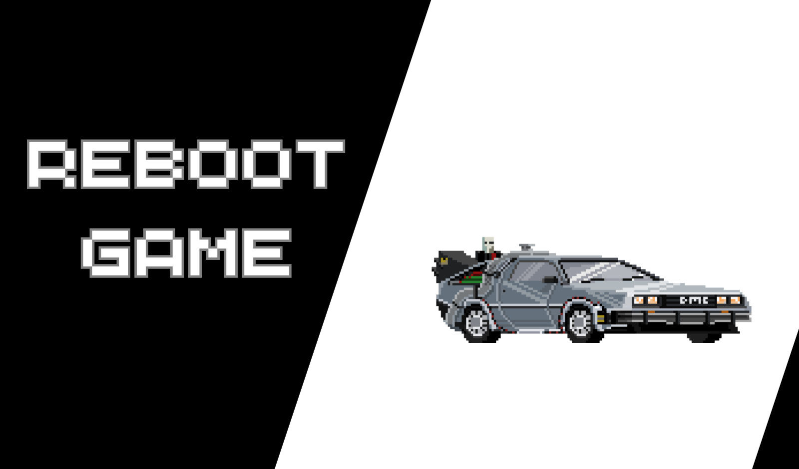

### RebootRace

# Description
This game is inspirated in the Arcade's games of cars of 80-90's like "*Monaco GP*", "*Super Stock Car*" or "*Lastest Lap*"

# Game's elements
- Road
- Player
- Rival's cars

# Objective
Dodge rival's cars in the maximum time possible. Our player can move with the keyboard's arrows: left, rigth, down and up.

# Project's duration:

**Project Start**: march/27
**v. Alpha 1**: march/31

# Future implementations
 - Improve the movement of the cards
 - More lives in a game
 - Other rivals with movement in the X-axis
 - Historical Ranking
 - Add other levels and stages

# Creaters:

1. Ramsés Domínguez Ferrera  
- Github's username: **[rdominguezferrera](https://github.com/rdominguezferrera)**

2. Pedro Adasat Bonilla Bolaños
- Github's username: **[Adasat](https://github.com/Adasat)**

3. Abel López Pérez
- Github's username: **[Grancan91](https://github.com/Grancan91)**

